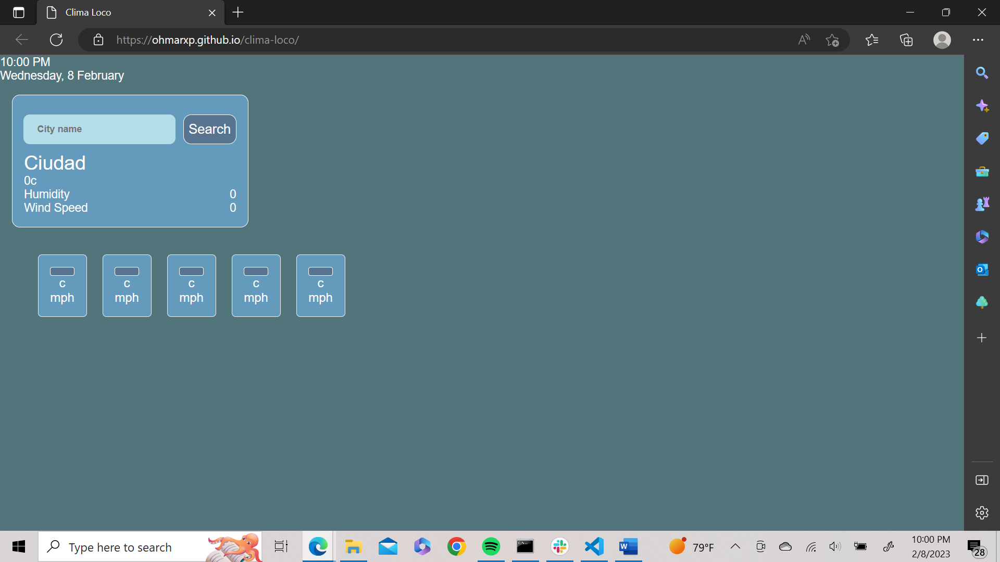

# Clima Loco

## Description

This project is the sixth challenge assignment for bootcamp students. 

This assignment main task was the creation of a weather forecast page by putting in practice all skills learned.

In this project, no starter html, CSS, or js code were provided, everything had to be created from scracth.

## Usage
Enter the name of the city you want to get the updated weather forecast and click the Search button.

## Credits

Link to deployed application: https://ohmarxp.github.io/clima-loco/

## License

N/A

